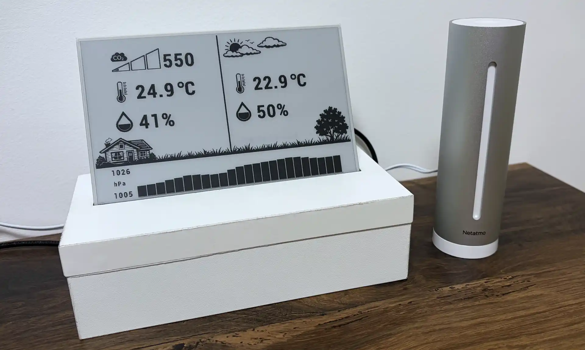

# eink-weather-display

Weather display built using ESP32 and a 7.5" e-paper panel. It reads a
[Netatmo](https://www.netatmo.com/) weather station and shows indoor and outdoor temperature,
humidity, CO2 and a 48-hour pressure chart.



## Hardware

- [Waveshare ESP32 Driver Board](https://www.waveshare.com/wiki/E-Paper_ESP32_Driver_Board)
- [Waveshare 7.5" e-Paper HAT V2](https://www.waveshare.com/wiki/7.5inch_e-Paper_HAT) — 800×480, black/white
- [CH343 USB driver](https://files.waveshare.com/upload/0/04/CH34XSER_MAC.7z) - needed to flash and monitor on macOS

## Setup

Requirements: PlatformIO, NodeJS

1. Register an app at [dev.netatmo.com](https://dev.netatmo.com/apps) for a client id and secret

2. Create the secrets file `/src/config.secret.h` based on template `/src/config.secret.template.h` and replace placeholders

   _Google Sheets fields are optional, empty means serial-only logging. See [LOG_README.md](eink-display-firmware/tools/logging/LOG_README.md) in `tools/logging`_

3. Build and flash

```bash
cd eink-display-firmware && ~/.platformio/penv/bin/pio run -e esp32dev --target upload
```

4. Monitor the output

```bash
cd eink-display-firmware && ~/.platformio/penv/bin/pio device monitor
```

5. Open web browser at `http://<device-ip>/` and use the login to authenticate the application

## Refresh behaviour

Most of the time Netatmo uploads new measurements every 10 minutes (but occasionally it updates after 5 or 15 minutes).
Refreshes are scheduled shortly after next expected update, based on last received data timestamp.
In case of missing data (for example server outage) the next refresh is scheduled for closest multiple of refresh interval that is in the future.
During the night, display shows a static image. Both night time and config interval are defined in `config.h`.

## Development

Build and static analysis:

```bash
cd eink-display-firmware
~/.platformio/penv/bin/pio run -e esp32dev
~/.platformio/penv/bin/pio check -e esp32dev
```

The workbench is entirely AI-generated tool providing various utilities helping with development

```bash
cd eink-display-firmware/tools/workbench && npm install && npm start
```

### Tests

Tests do not run under `pio test`, because PlatformIO's runner is built for on-device testing and the test suite
was built to run locally. Therefore only `src/platform/arduino/` contains Arduino headers, everything else
compiles with g++ on the host.

Tests can be run via workbench UI or in headless mode

```bash
cd eink-display-firmware/tools/workbench && npm test
```

## Layout

```
eink-display-firmware/
  src/                firmware
  test/               host tests, fakes and fixtures
  lib/                vendored Waveshare EPD driver
  tools/workbench/    dev tool
  tools/logging/      optional Google Apps Script log sink
```
